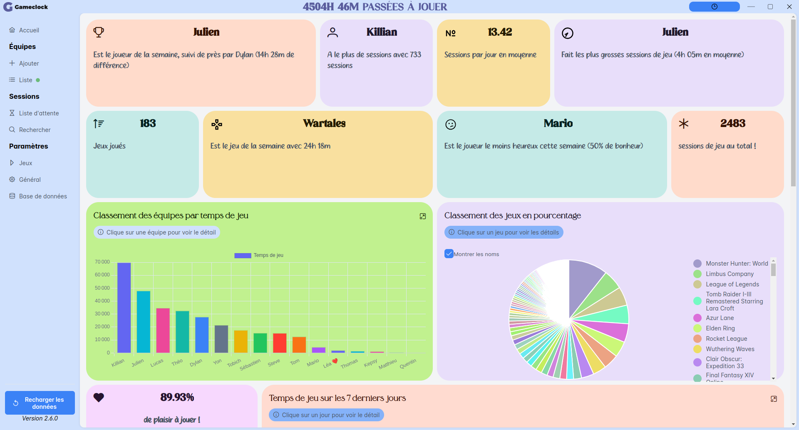

<div id="top"></div>
<!--
*** Thanks for checking out the Best-README-Template. If you have a suggestion
*** that would make this better, please fork the repo and create a pull request
*** or simply open an issue with the tag "enhancement".
*** Don't forget to give the project a star!
*** Thanks again! Now go create something AMAZING! :D
-->

<!-- PROJECT SHIELDS -->
<!--
*** I'm using markdown "reference style" links for readability.
*** Reference links are enclosed in brackets [ ] instead of parentheses ( ).
*** See the bottom of this document for the declaration of the reference variables
*** for contributors-url, forks-url, etc. This is an optional, concise syntax you may use.
*** https://www.markdownguide.org/basic-syntax/#reference-style-links
-->

[![repo-size][repo-size-shield]][repo-size-url]
[![License][license-shield]][license-url]

<!-- PROJECT LOGO -->
<br />
<div align="center">
    

  <h3 align="center">GameClock</h3>

  <p align="center">
    Track your Game time with your friends !
  </p>
</div>

## About The Project

GameClock is an Electron application with <a href="https://vuejs.org/">Vue</a> and <a href="https://firebase.google.com/">Firebase</a> that allow you to track your game time with anyone that has access to your database !




<p align="right">(<a href="#top">back to top</a>)</p>

### Built With

- [Vue.js](https://vuejs.org/)
- [Firebase](https://firebase.google.com/)
- [PrimeVue](https://primevue.org/)
- [SteamGridDB](https://www.steamgriddb.com/)

<p align="right">(<a href="#top">back to top</a>)</p>

<!-- DOWNLOAD -->

## Download

Go to the <a href="https://github.com/Didiloy/GameClock/releases">Release page</a>

<!-- GETTING STARTED -->

## Getting Started

To get a local copy up and running follow these simple steps.

### Prerequisites

Have `node` installed.

### Installation

1. Clone the repo
   ```sh
   git clone https://github.com/Didiloy/GameClock.git
   ```
2. Navigate to the directory named GameClock
   ```sh
   cd GameClock
   ```
3. Install NPM packages
   ```sh
   npm install
   ```
4. Launch the developpement server
   ```sh
   npm run dev
   ```

<p align="right">(<a href="#top">back to top</a>)</p>

## License

Distributed under the GPLv3 License.

<p align="right">(<a href="#top">back to top</a>)</p>

<!-- MARKDOWN LINKS & IMAGES -->
<!-- https://www.markdownguide.org/basic-syntax/#reference-style-links -->

[repo-size-shield]: https://img.shields.io/github/repo-size/didiloy/gameclock
[repo-size-url]: https://github.com/Didiloy/gameclock/graphs/contributors
[license-shield]: https://img.shields.io/badge/Licence-GPLv3-brightgreen
[license-url]: https://www.gnu.org/licenses/gpl-3.0.html
